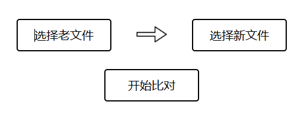
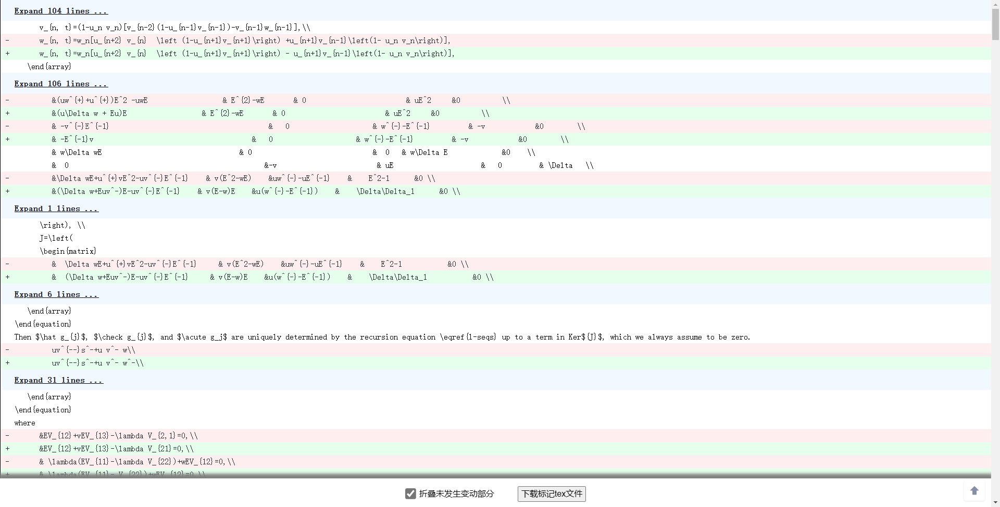

# tex-diff-viewer
逐行比较两个tex文件之间的差异

基于 [Diff](https://github.com/kpdecker/jsdiff) 和 [react-diff-viewer](https://github.com/praneshr/react-diff-viewer).

界面如下

打开两个文件以后, 点击开始对比, 如下所示

取消勾选`折叠未发生变动部分`, 可以下载标记过的新老文件. 运行以后, 如下所示

左侧是旧的pdf文件, 改动的地方用红色标记, 右侧是新的pdf文件, 改动的地方用蓝色标记.
